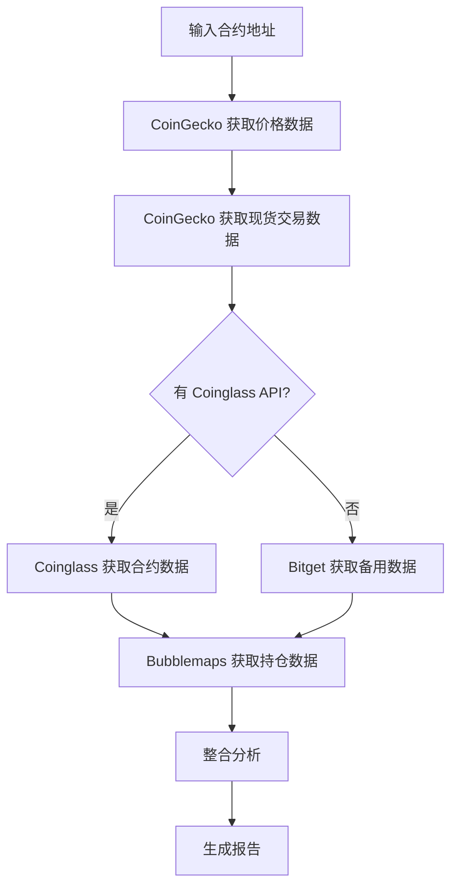

# 🦞 dy-jk — 代币交易分析 Skill

> **一键生成代币交易分析报告** | 解锁压力 + 持仓集中度 + 衍生品数据 + 风险评估

[](https://opensource.org/licenses/MIT)
[](https://openclaw.ai)

---

## 📖 项目简介

**dy-jk** 是一个专为加密货币交易设计的分析工具，通过一键命令生成全面的代币交易分析报告。

**核心功能**:
- 📊 **解锁压力分析** - 解锁时间、抛压比例、历史回测
- 🔍 **持仓集中度** - Top 持仓地址、CEX 关联度、集群分析
- 📈 **衍生品数据** - 资金费率、持仓量、多空比、期货/现货比
- 💰 **现货流动性** - 交易所覆盖、成交量分布
- ⚠️ **风险评估** - 综合评级、交易建议

**数据来源**:
- CoinGecko (价格、市值)
- Coinglass (合约数据、资金费率) - *需 API Key*
- Bubblemaps (链上持仓分析)
- Bitget (备用衍生品数据)

---

## 🚀 快速开始

### 前置要求

```bash
# 必需工具
curl jq node awk

# 可选 (推荐) - Coinglass API Key
export COINGLASS_API_KEY="your_api_key_here"
# 或
export CG_API_KEY="your_api_key_here"
```

### 使用方法

```bash
# 基本用法
./scripts/build_trade_report.sh --address <代币合约地址> --chain <链>

# 完整示例 - 分析 STABLE (BSC)
./scripts/build_trade_report.sh \
  --address 0x0000000000000000000000000000000000001003 \
  --chain bsc

# 分析 ZRO (Ethereum)
./scripts/build_trade_report.sh \
  --address 0x6985884C4392D348587B19cb9eAAf157F13271cd \
  --chain eth

# 带代理 (如果 API 被墙)
./scripts/build_trade_report.sh \
  --address <地址> \
  --chain eth \
  --proxy http://127.0.0.1:7897
```

### 参数说明

| 参数 | 必需 | 说明 | 示例 |
|------|------|------|------|
| `--address` | ✅ | 代币合约地址 | `0x6985884C...` |
| `--chain` | ❌ | 链名称 | `eth`, `bsc`, `solana` (默认：solana) |
| `--date` | ❌ | 分析日期 | `YYYY-MM-DD` (默认：今天) |
| `--count` | ❌ | 持仓分析数量 | `250` (默认：250) |
| `--proxy` | ❌ | HTTP 代理 | `http://127.0.0.1:7897` |
| `--skip-concentration` | ❌ | 跳过持仓分析 | - |
| `--lang` | ❌ | 输出语言 | `zh`, `en` (默认：zh) |
| `--out` | ❌ | 输出文件路径 | `/tmp/report.md` |

---

## 📊 输出示例

```bash
========================================================
DY-JK Token Analysis Report
代币：LayerZero (ZRO)
分析日期：2026-03-08
========================================================

[0] 核心指标快照
- 价格：$1.88
- 市值：$5.72 亿
- 完全稀释估值 (FDV)：$18.8 亿
- FDV/MCAP：3.29x
- 流通率：30.38%
- 解锁抛压：69.62%
- 排名：#87

[1] 价格表现
- 7 天：+19.37%
- 30 天：+9.53%
- 90 天：-12.94%

[2] 现货流动性
- 主要现货交易对：ZRO/USDT
- 24h 现货成交量：$72.74M
- 现货交易所数量：15+
- 数据来源：coingecko

[3] 衍生品数据
- 合约交易对：ZRO/USDT
- 24h 合约成交量：$95.32M
- 期货/现货比率：1.31x
- 资金费率：-0.0085%
- 持仓量：$48.56M
- 多空比：0.91
- 数据来源：coinglass

[4] 持仓集中度
- Top 持仓覆盖：47.99%
- 非 CEX 集中度：47.99%
- 最大集群 (非 CEX)：N/A
- 快照日期：2026-03-07

[5] 解锁压力
- 下次解锁：2026-03-20 (13 天后)
- 解锁抛压：69.62%
- 流通率：30.38%

[6] 综合风险评级
- 风险等级：Medium
- 趋势状态：Neutral

[7] 风险提示
- 流动性比率：0.13
- 如果期货/现货成交量比 > 3x 且资金费率为正，注意杠杆拥挤和多头踩踏风险
- 如果非 CEX 关联集群 > 70%，视为事件驱动资产，建议小仓位 + 快速止损

[8] 数据源健康检查
- 市场数据源：ok
- 持仓数据源：/tmp/dy_jk_report.json
- 衍生品数据源：coinglass
- 现货数据源：coingecko

[9] 中文结论
- 盘面驱动：合约活跃度高于现货，短线更受衍生品驱动
- 杠杆情绪：资金费率温和，杠杆方向不算极端
- 多空结构：多空比相对均衡
- 筹码判断：筹码分散度尚可
- 解锁判断：仍有较明显解锁空间，需要结合日程观察

========================================================
DASH

- 解锁前观望，解锁后根据实际抛压决定
- 当前期货/现货比 1.31x，杠杆不算极端
- 关注 3 月 20 日解锁日前后链上转账

========================================================
```

---

## 🔧 技术架构

### 目录结构

```
dy-jk/
├── scripts/
│   ├── build_trade_report.sh    # 主分析脚本
│   └── verify_concentration.sh  # 持仓分析脚本
├── references/
│   ├── trading-framework.md     # 交易框架文档
│   └── unlock-presets.json      # 解锁日程预设
├── SKILL.md                     # Skill 配置
└── README.md                    # 本文档
```

### 分析流程



### 数据源优先级

| 数据类型 | 首选 | 备用 |
|---------|------|------|
| 价格/市值 | CoinGecko | - |
| 现货成交量 | Coinglass | CoinGecko |
| 合约数据 | Coinglass | Bitget |
| 持仓集中度 | Bubblemaps | - |

---

## 📋 解锁预设配置

项目包含解锁日程预设文件 (`references/unlock-presets.json`)，支持自动回测历史解锁表现。

### 添加新代币解锁日程

```json
{
  "zro": {
    "start_date": "2025-06-20",
    "months": 24,
    "unlock_day": 20
  }
}
```

**字段说明**:
- `start_date`: 解锁开始日期
- `months`: 解锁月数
- `unlock_day`: 每月解锁日 (1-31)

---

## 🎯 使用场景

### 1. 解锁前分析
```bash
# 分析即将解锁的代币
./scripts/build_trade_report.sh \
  --address 0x6985884C4392D348587B19cb9eAAf157F13271cd \
  --chain eth
```

### 2. 持仓集中度检查
```bash
# 快速检查持仓集中度
./scripts/verify_concentration.sh \
  --address <地址> \
  --chain eth
```

### 3. 批量分析
```bash
# 批量分析多个代币
for addr in 0x... 0x... 0x...; do
  ./scripts/build_trade_report.sh --address $addr --chain eth
done
```

---

## ⚠️ 注意事项

1. **Coinglass API Key** (可选但推荐)
   - 注册地址：https://www.coinglass.com/api
   - 设置环境变量：`export COINGLASS_API_KEY="your_key"`

2. **代理配置**
   - 如果 API 被墙，使用 `--proxy` 参数
   - 或设置全局代理：`export HTTPS_PROXY=http://127.0.0.1:7897`

3. **链支持**
   - 支持链：`eth`, `bsc`, `solana`, `base`, `arbitrum`, `polygon`, `avax` 等
   - 确保合约地址与链匹配

4. **数据准确性**
   - 解锁回测需要代币在 CoinGecko 有 365 天历史数据
   - 新代币可能缺少部分数据

---

## 🤝 贡献

欢迎提交 Issue 和 Pull Request！

### 开发环境设置

```bash
# 克隆项目
git clone https://github.com/dennyhuang2024/dy-jk.git
cd dy-jk

# 安装依赖 (可选)
brew install curl jq node

# 运行测试
./scripts/build_trade_report.sh --address 0x... --chain eth
```

### 代码规范

- Shell 脚本遵循 Bash 最佳实践
- 使用 `shellcheck` 进行代码检查
- 提交信息使用约定式提交格式

---

## 📄 许可证

MIT License © 2026 [Denny Huang](https://github.com/dennyhuang2024)

---

## 🙏 致谢

感谢以下开源项目和服务：

- [CoinGecko](https://www.coingecko.com/) - 价格和市值数据
- [Coinglass](https://www.coinglass.com/) - 合约和衍生品数据
- [Bubblemaps](https://bubblemaps.io/) - 链上持仓分析
- [OpenClaw](https://openclaw.ai/) - Skill 框架

---

## 📞 联系方式

- GitHub: [@dennyhuang2024](https://github.com/dennyhuang2024)
- Twitter: [@sherlock2023](https://twitter.com/sherlock2023)

---

**⚠️ 免责声明**: 本工具仅供参考，不构成投资建议。加密货币投资风险极高，请务必 DYOR (Do Your Own Research)。

---

*Made with 🦞 by Denny Huang*
